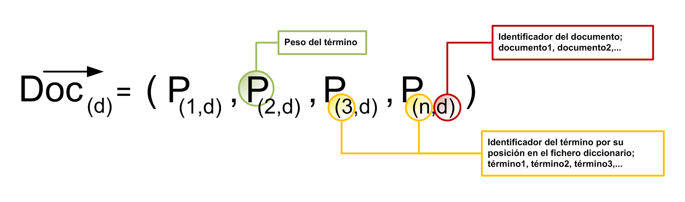
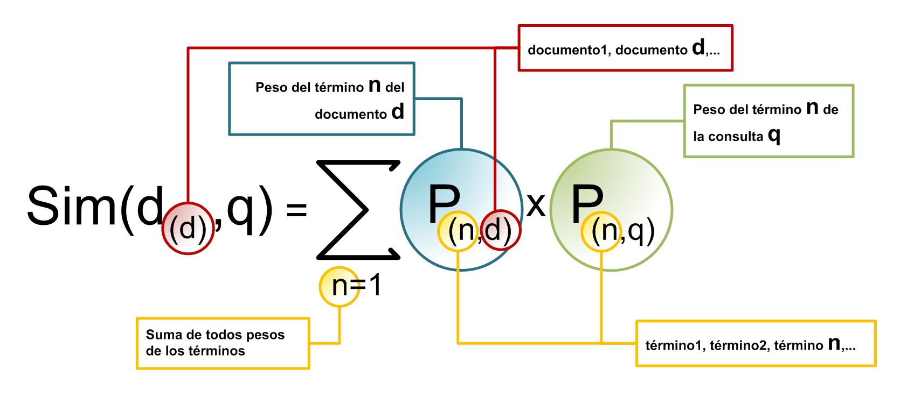
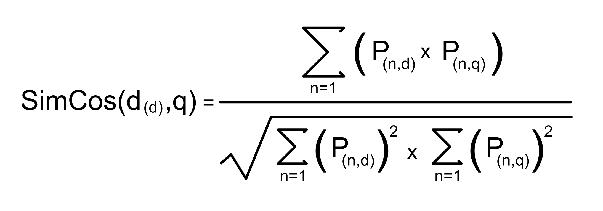
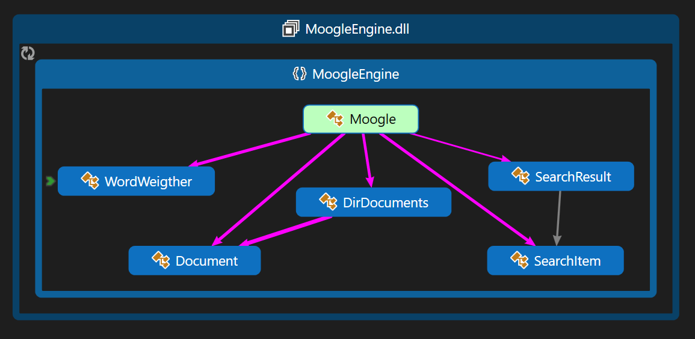
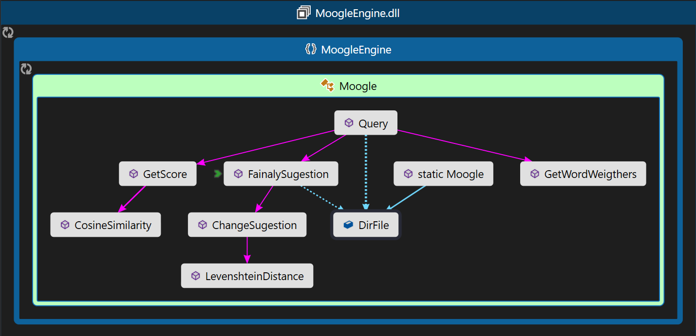

# Moogle


**Proyecto de Programación I. Facultad de Matemática y Computación. Universidad de La Habana. Curso 2021.**

Moogle! es una aplicación *totalmente original* cuyo propósito es buscar inteligentemente un texto en un conjunto de documentos.

Es una aplicación web, desarrollada con tecnología .NET Core 6.0, específicamente usando Blazor como *framework* web para la interfaz gráfica, y en el lenguaje C#.
La aplicación está dividida en dos componentes fundamentales:

- `MoogleServer` es un servidor web que renderiza la interfaz gráfica y sirve los resultados.
- `MoogleEngine` es una biblioteca de clases donde está... ehem... casi implementada la lógica del algoritmo de búsqueda.

# Sobre la búsqueda
Para que la búsqueda sea lo más inteligente posible, Hemos implementado un`Modelo vectorial` de recuperación de la información. Este modelo tiene su base en el álgebra lineal multidimensional. Los términos indexados, como los documentos se modelan como vectores, los cuales son llamados `vectores-términos` y `vectores-documentos`, respectivamente. En el modelo vectorial se intenta recoger la relación de cada
documento Di, de una colección de N documentos, con el conjunto de las m características de la colección. Formalmente un documento puede considerarse como un vector que expresa la relación del documento con cada una de esas características.



Es decir, ese vector identifica en qué grado el documento Di satisface cada una de las m características. En ese vector, Cik es un valor numérico que expresa en qué grado el documento Di posee la característica k. El concepto `característica` suele concretarse en la ocurrencia o relevancia de determinadas palabras o términos en el documento, aunque nada impide tomar en consideración otros aspectos.

Para implementar este modelo debemos determinar las características definitorias del documento, el proceso pasa primero por seleccionar aquellos términos útiles que permitan discriminar unos documentos de otros. No todas las palabras contribuyen con la misma importancia en la caracterización del documento. Existen palabras casi vacías de contenido semántico, como los artículos, preposiciones o conjunciones, que son poco útiles en el proceso.

Para determinar la capacidad de representación de un término para un documento dado se
computa el número de veces que aparece en dicho documento, obteniéndose la frecuencia del
término en el documento, tf (term frequency).

Podría decirse que la capacidad de recuperación de un término es inversamente proporcional a su frecuencia en la colección de documentos. Esto es lo que se conoce como idf (inverse document frequency). Así, para calcular el peso de cada elemento del vector que representa al documento se tiene en cuenta la frecuencia inversa del término en la colección, combinándola de alguna forma con
la frecuencia del término dentro de cada documento. Normalmente se utiliza para ello el producto simple.

`Wij= tfi * idfj`

Una vez modelado el sistema vectorial con el peso de cada termino; solo nos queda por realizar aplicarle el mismo proceso a la consulta y determinar el `grado de similitud` con los documentos. El modo más simple de calcular la similitud entre una consulta y un documento, utilizando el modelo vectorial, es realizar el producto escalar de los vectores que los representan. En esa ecuación se incluye la normalización de los vectores, a fin de obviar distorsiones producidas por los diferentes tamaños de los documentos. El índice de similitud más utilizado es el coseno del ángulo formado por ambos vectores. Para una consulta Q, el índice de similitud
con un documento Di es:

# Similaridad-producto-escalar


# Similaridad-coseno
*Nota: Implemente Similaridad-coseno*



Los documentos con mayor grado de similitud son aquellos que mayor `score` tendrán. Los documentos de mayor `score` serán los devueltos por el buscador.

Si desea seguir documentadose sobre esto puede dirigirse a:
https://es.wikipedia.org/wiki/Modelo_vectorial_generalizado
 
# Operadores de búsqueda
**Para brindar mayores funcionalidades a nuestros usuarios hemos implementado un sistema ponderador de palabras con el objetivo de facilitar la obtención de información.**

**Moogle cuenta con una serie de operadores:**

-Un símbolo `!` delante de una palabra (ej., `"algoritmos de búsqueda !ordenación"`) indica que esa palabra **no debe aparecer** en ningún documento que sea devuelto.

- Un símbolo `^` delante de una palabra (ej., `"algoritmos de ^ordenación"`) indica que esa palabra **tiene que aparecer** en cualquier documento que sea devuelto.

- Cualquier cantidad de símbolos `*` delante de un término indican que ese término es más importante, por lo que su influencia en el `score` debe ser mayor que la tendría normalmente (este efecto será acumulativo por cada `*`, por ejemplo `"algoritmos de **ordenación"` indica que la palabra `"ordenación"` tiene dos veces más prioridad que `"algoritmos"`).

- Un símbolo `~` entre dos o más términos indica que esos términos deben **aparecer cerca**, o sea, que mientras más cercanos estén en el documento mayor será la relevancia. Por ejemplo, para la búsqueda `"algoritmos ~ ordenación"`, mientras más cerca están las palabras `"algoritmo"` y `"ordenación"`, más alto debe ser el `score` de ese documento.

- Notas:
El operador `~` ha sido de implementado de manera tal que sol será funciona si aparece despegado de las palabras 
(ej., `"algoritmos ~ ordenación"`). Un ejemplo de no funcionalidad será `"algoritmos~ ordenación"` o `"algoritmos ~ordenación"` en estos casos será totalmente ignorado.

# Sobre la ingeniería de software

**Para implementar la lógica del algoritmo de búsqueda hemos creado varias clases fundamentales:**

- `Document` Clase base creada para manejar archivos, tratar su texto correspondiente.
- `DirDocument` Clase que recoge una lista de `Document` y se encarga del manejo del volumen de archivos y Calcula los Tf-Idf(relevancias) de las palabras de todos los documentos.
- `WordWeigther` Clase base para la construcción de un método ponderador de palabras

**El objeto `Document`** tiene una sobrecarga del constructor esto se implementó así debido a que el query debía ser tratado como un documento.
El 1er constructor recibe dos argumentos: `title` y `path` ; el 2do constructor solo se le pasa un string `text` .El parámetro `Title` es de tipo string. El parámetro `Path` es de tipo string (dirección del documento).El parámetro `Words` es de tipo `List<string>` contiene todas las palabras del documento. El parámetro `Frecuency` es un de tipo `Dictionary<string,List<int>>` y contiene una palabra como llave y como valor contiene una lista de posiciones de la palabra. Si hacemos una observación la frecuencia correspondiente seria él `.Count` de esa lista. El parámetro `MaxFrecuency` es un valor int donde se guarda la mayor frecuencia del listado de palabras. El 2do constructor se le asigna como `title` y como `path` una cadena vacía, esto se debe que el `query` como documento no los necesita.

## Constructor de `Document`
```cs
 public Document(string title, string path)
        {
            this.Title = title;
            this.Path = path;
            Words = new List<string>();

            string text = GetFileText(path);
            ComputeWords(text);
            Frecuency = new Dictionary<string, List<int>>();
            ComputeFrecuence();
        }
        
        // Costructor de Query
        public Document(string text)
        {
            this.Title = string.Empty;
            this.Path = string.Empty;
            Words = new List<string>();
            ComputeWords(text);
            Frecuency = new Dictionary<string, List<int>>();
            ComputeFrecuence();
        }
```
-Para Construir el objeto `Document` nos auxiliamos de algunos metodos bastante simples por lo que solo serán mencionados:

```cs
//Procesa el texto eliminado símbolos y lo asocia a la lista de `Words`
 private void ComputeWords(string text)
```
```cs
// Se le él pasa un path de un document y devuelve las palabras del documento en ese path.
private static string GetFileText(string path)
```
```cs
//Construye los parametros Frecuency y MaxFrecuency
//(recorre la lista de words guarda las no repetidas las cuenta y guarda la que mas se repite)
 private void ComputeFrecuence() 
```
------------------------------------------------------------------------------------------------------------------------------------------
**El objeto `DirDocument`** recibe en su constructor un argumento: `path`. El parámetro `Documents` es de tipo `List<Document>` que recoge todos los documentos de un directorio. El parámetro `WordCountContains` es de tipo `Dictionary<string, int>` como llave tiene una palabra y como valor el número de documentos que la contiene. El parámetro `DocRelevance` es de tipo `Dictionary<string,Dictionary<string,float>>` puede verse como la representación de este modelo vectorial donde se tiene algo similar a una matriz o algo similar a un array de arrays;

- Para Construir el objeto `DirDocument` no auxiliamos de algunos métodos bastante simples para su entendimiento por lo que solo serán mencionados:
- Comentaremos en que se basan algunos métodos utilizados para darle funcionalidad al modelo vectorial.

## Constructor de DirDocuments
```cs

    public DirDocuments(string path)
    {
        // Construye  una lista del tipo Document.
        Documents = new List<Document>();
        
        //Carga la lista de documentos.
        LoadDocument(path);
        
        // Construye el objeto que contendra los vectores documento [key:palabra value:[key:archivo value:relavancia]]
        DocRelevance = new Dictionary<string, Dictionary<string, float>>();
        
        //Carga la los vectores documentos.
        LoadRelevance();
    }
 ```
 
```cs
        //Se usa para determinar cuantos archivos contienen una palabra.Estos datos son almacenados en el parámetro `WordCountContains`.
        int CountContains(string word)
 ```
```cs
        // Se le pasa una palabra y calcula los TfxIdf de un 'columna' o sea calcula los TfxIdf de esa palabra dentro de todos los documentos
        private Dictionary<string, float> GetRelevance(string word)
 ```     
```cs
        // Calculo del TF x IDF para eso usa la formula expuesta anteriormente
        private float ComputeTFxIDF(float frecuence, float maxfrecuence, float numFile, float containfile)
        {
            float rtn = (float)(frecuence / maxfrecuence) * (float)Math.Log10(numFile / (containfile + 1));
            return rtn;
        }
```
```cs
         //Determina si una palabra es StopWords son aquellas palabra que tiene una presencia mayor del 80% en los documentos
         public bool StopWords(string word)
```       
```cs    
        // Obtiene el vector documento.
        public List<float> BuildVector(Document document, List<string> query)
```
```cs 
        // Obtiene el vector query
        public List<float> BuildVectorQuery(Document query)
```       
```cs
        //Normaliza el vector
        public static List<float> Normalize(List<float> vector)
        {
            List<float> result = new List<float>();

            float sumSquared = 0;
            foreach (var value in vector)
            {
                sumSquared += value * value;
            }

            float SqrtSumSquared = (float)Math.Sqrt(sumSquared);

            foreach (var value in vector)
            {
                // L2-norm: Xi = Xi / Sqrt(X0^2 + X1^2 + .. + Xn^2) 
                result.Add(value / (SqrtSumSquared + float.Epsilon));
            }
            return result;
        }
```

# Que es Normalizar un vector?


------------------------------------------------------------------------------------------------------------------------------------------


------------------------------------------------------------------------------------------------------------------------------------------


------------------------------------------------------------------------------------------------------------------------------------------


------------------------------------------------------------------------------------------------------------------------------------------
**El tipo `WordWeigther`** es una estructura básica que utilice para construir un ponderador de palabras. El parámetro `Operator` es del tipo char se le asigna un operador. El parámetro `Word` de tipo string contiene la palabra que tiene ese operador, El parámetro `Weigth` contiene una puntuación.

**El tipo `PosAndDist`** es una estructura básica que utilice para crear el snipet.El parámetro `PositionA` es del tipo int se le asigna la posición de una palabra A. El parámetro `PositionB` es del tipo int se le asigna la posición de una palabra B, El parámetro `Distance` contiene la distancia entre estas dos palabras.

**tipo `TuplaString`** es una estructura básica que utilice para crear el snipet.El parámetro `WordI` es del tipo string y se le asigna una palabra I .El parámetro `WordF` es del tipo string y se le asigna una palabra F.   

------------------------------------------------------------------------------------------------------------------------------------------
# Class Moogle
Estas clases y algunos métodos  definidos **Class Moogle** se utilizan para darle funcionalidad a la búsqueda.

- El objeto DirFie sostiene el modelo vectorial.
```cs
 private static DirDocuments DirFile = new DirDocuments(Path.GetDirectoryName(Directory.GetCurrentDirectory()) + @"\Content");
```

- Métodos relacionados con el cálculo de score
```cs
 //Determiana La similaridad coseno
 public static float CosineSimilarity(List<float> vectorDoc, List<float> vectorQuery)
 ```
 ```cs
 // Construye un array que pondera las palabras segun el operador
 private static WordWeigther[] GetWordWeigthers(string[] terms)
 ```
 ```cs 
 //Utiliza las WordWeigthers y la similaridad coseno para determinar un score
public static float GetScore(Document document, List<float> vectorDoc, List<float> vectorQuery, WordWeigther[] terms)
```

-Metodos relacionados con la Sugestion
```cs
//Calcula la disimilitud entre dos palabras
public static int LevenshteinDistance(string s, string t)
```
```cs
//Construye la sugestion
public static string FainalySugestion(Document query, List<string> dirwords)
```
```cs 
// Usa la disimilitud para crear una lista de los posibles cambios
public static string ChangeSugestion(string word, List<string> dirwords)
```
```cs
-Metodos relacionados con la Snippet.
//Hace un principio de mezcla, pero calcula la distancia.
 public static PosAndDist MergeDistantce(List<int> poswA, List<int> poswB)
```
```cs 
//Obtiene el Snippet(toma las palabras dos palabras con mayor relevancia y de vuelve el tramo que contenga a ambas en menor distancia)
GetSnippet(Document document, Dictionary<string, float> query)
```

```cs
// Determina las dos de la búsqueda con mayor relevancia
 public static TuplaString WordsMax(Dictionary<string, float> wordr)
```
# Diagrama de clases
- *Nota: El diagrama de clases está en el proyecto con el podrá observar el flujo del proyecto*

   

   

# Posibles mejoras a deficiencias 
- Como posibles mejoras esta la optimización del proceso de búsqueda. 

- Reajustar el funcionamiento de los operadores.

- Serializar la matriz para hacer la construcción de la matriz solo una vez.

- Anadir sinónimos a la búsqueda. 

- Anadir un lematizador para mejorar la búsqueda.

- Mejorar la interfaz gráfica. 

- Hacer que los error de tíldes cuenten para disminuir relevancia pero si realice la busqueda.

- Mejorar la suggestion que puede equivocarse con las stopwords.

- Posibilitar que no solo busque en .txt hacer que busque en .html

# Ventajas e inconvenientes del modelo vectorial

## Ventajas
El modelo vectorial es muy versátil y eficiente a la hora de generar rankings de precisión en colecciones de gran tamaño, lo que le hace idóneo para determinar la equiparación parcial de los documentos. 
Tiene en cuenta los pesos TF-IDF para determinar la representatividad de los documentos de la colección.

## Inconvenientes
El modelo vectorial por producto escalar tiene la desventaja de que sólo tiene en cuenta la intersección de los términos del documento con respecto a la consulta, por lo que la gradación de los resultados no es tan precisa como en el caso del cálculo del coseno.
Necesita de la intersección de los términos de la consulta con los documentos, en caso contrario no se produce la recuperación de información.
Al ser un modelo estadístico-matemático, no tiene en cuenta la estructura sintáctico-semántica del lenguaje natural

# Bibliografía 
http://eprints.rclis.org/13963/1/zazo2002recuperacion.pdf
http://ccdoc-tecnicasrecuperacioninformacion.blogspot.com/2012/12/modelo-vectorial.html
https://es.khanacademy.org/computing/computer-programming/programming-natural-simulations/programming-vectors/a/vector-magnitude-normalization#:~:text=Normalizar%20se%20refiere%20al%20proceso,%2C%20bueno%2C%20%E2%80%9Cnormal%E2%80%9D.&text=Por%20lo%20tanto%2C%20normalizar%20un,conoce%20como%20un%20vector%20unitario.
https://www.wikipedia.org/
